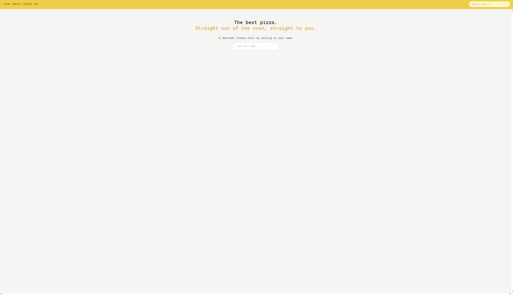
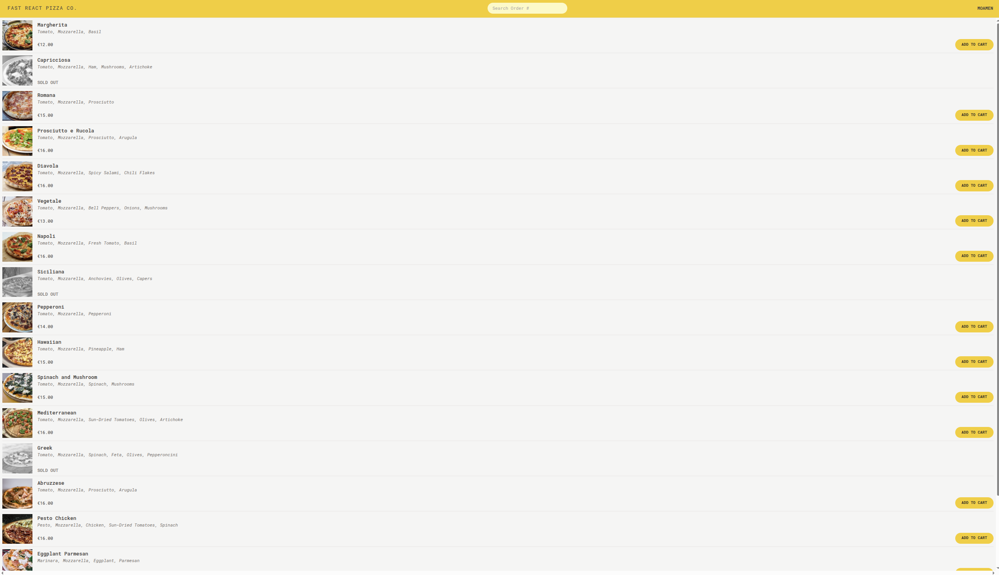
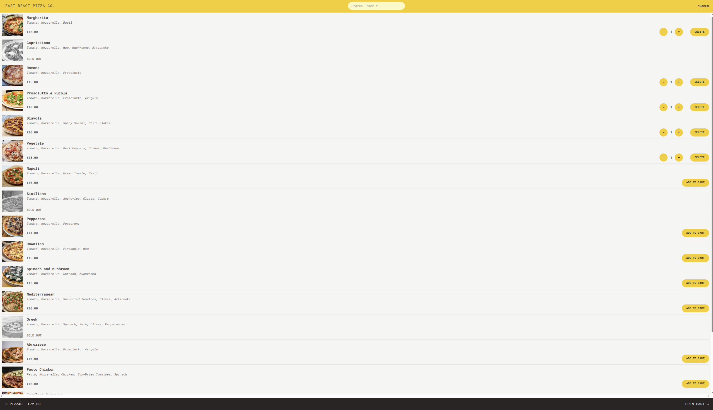
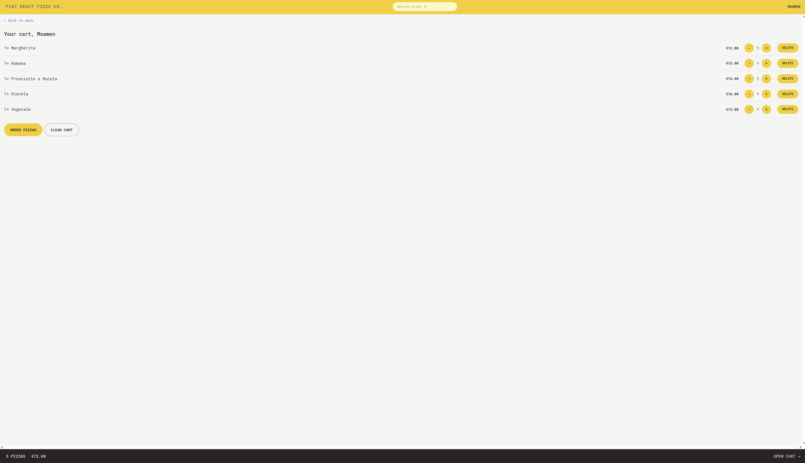
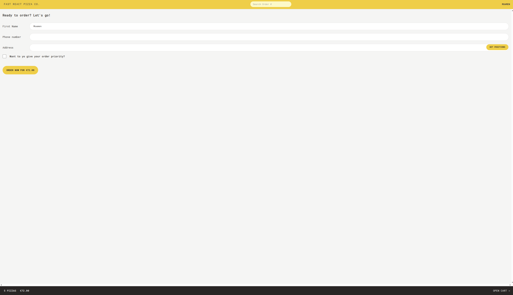
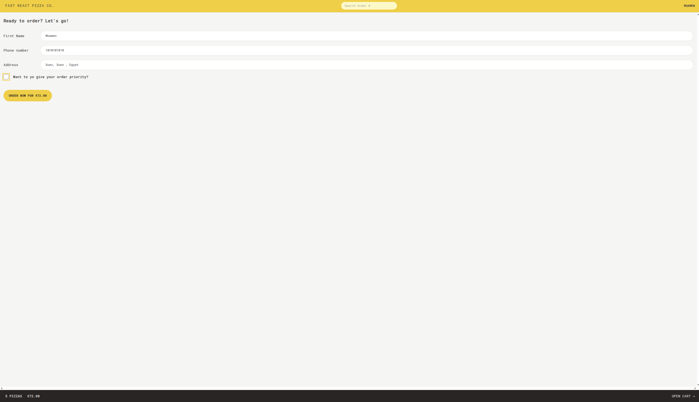
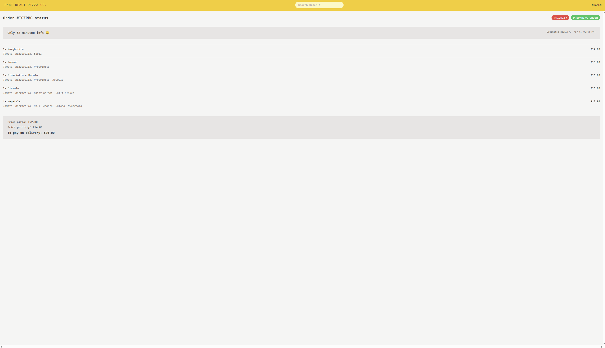

# 🍕 Fast React Pizza Co. — Pizza Ordering App

> The best pizza. Straight out of the oven, straight to you.

---

## 📸 Screenshots

### 🏠 Home — Enter Your Name

<p align="center">
  
</p>

---

### 🍕 Menu

<p align="center">
  
</p>

---

### 🛒 Menu — Items Added to Cart

<p align="center">
  
</p>

---

### 🧾 Cart

<p align="center">
  
</p>

---

### 📋 Order Form

<p align="center">
  
</p>

---

### 📋 Order Form — Filled

<p align="center">
  
</p>

---

### ✅ Order Status

<p align="center">
  
</p>

---

## 📌 Overview

**Fast React Pizza Co.** is a fast and minimal pizza ordering web application where users can browse the menu, add items to their cart, place an order with delivery details, and track their order status in real time using an order ID.

---

## ✨ Features

### 🏠 Home

- User enters their name to get started — no login or account required
- Name is stored in Redux and used throughout the app

### 🍕 Menu

- Fetches pizza menu from an API
- Displays pizza name, ingredients, price, and photo
- Sold out items are clearly marked and disabled
- Add to cart button per item
- Quantity controls (+ / −) and delete button for items already in cart
- Sticky bottom bar showing total pizzas & price with **Open Cart** button

### 🛒 Cart

- Lists all selected pizzas with quantity controls and delete buttons
- **Order Pizzas** button to proceed to checkout
- **Clear Cart** button to remove all items

### 📋 Order Form

- Pre-filled first name from Redux state
- Phone number & delivery address fields
- **Get Position** button — auto-fills address using GPS geolocation
- Priority order toggle (adds 20% surcharge)
- Displays total price dynamically before placing order

### ✅ Order Status

- Shows order ID, status badges (**Priority** / **Preparing Order**)
- Estimated delivery countdown timer
- Full breakdown: pizzas ordered, price, priority surcharge, total to pay on delivery

### 🔍 Search Orders

- Search any order by ID from the top navigation bar

---

## 🛠️ Tech Stack

| Category         | Technology             |
| ---------------- | ---------------------- |
| Framework        | React 18               |
| Build Tool       | Vite                   |
| Routing          | React Router DOM v6    |
| State Management | Redux Toolkit          |
| React-Redux      | React Redux v9         |
| Styling          | Tailwind CSS v3        |
| CSS Processing   | PostCSS + Autoprefixer |
| Code Formatting  | Prettier               |
| Linting          | ESLint                 |

---

## 🚀 Getting Started

### Prerequisites

- Node.js ≥ 18

### Installation

```bash
# Clone the repository
git clone https://github.com/MoamenElfateh/fast-react-pizza.git

# Navigate into the project
cd fast-react-pizza

# Install dependencies
npm install
```

### Running the App

```bash
# Start development server
npm run dev

# Build for production
npm run build

# Preview production build
npm run preview
```

---

## 📁 Project Structure

```
src/
├── features/
│   ├── cart/         # Cart slice, cart UI components
│   ├── menu/         # Menu fetching, pizza list & item
│   ├── order/        # Order form, order status, search
│   └── user/         # User name input, user Redux slice
├── services/         # API calls (menu, orders)
├── ui/               # Shared UI components (Header, Loader, etc.)
└── utils/            # Helper functions
```

---

## 👨‍💻 Author

**Moamen Mohamed Elfateh**

- 📧 moamenelfateh2@gmail.com
- 🔗 [LinkedIn](https://linkedin.com/in/moamen-mohamed-elfateh)
- 🐙 [GitHub](https://github.com/MoamenElfateh)
- 📍 Suez, Egypt

---

## 📄 License

This project is for educational and portfolio purposes.
