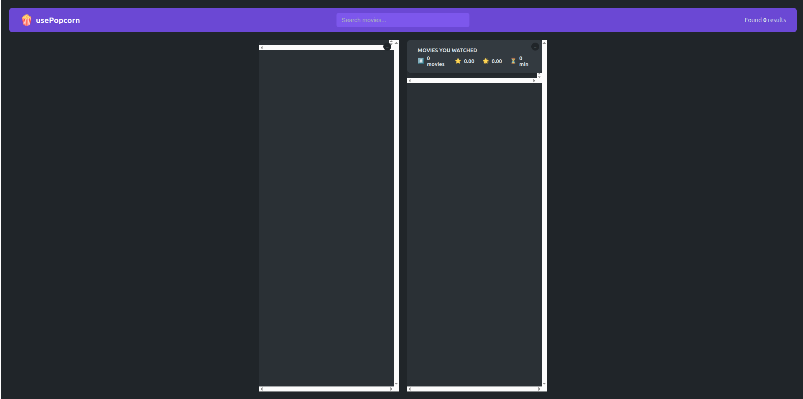
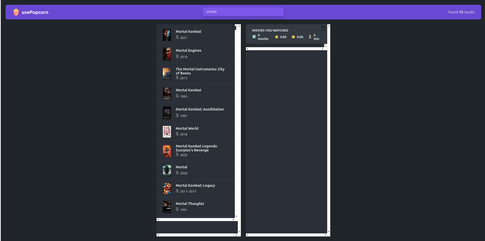

# 🍿 usePopcorn — Movie Search & Watchlist App

> Search movies, rate them, and keep track of everything you've watched.

---

## 📸 Screenshots

### 🏠 Home

<p align="center">
  
</p>

---

### 🔍 Search Results

<p align="center">
  
</p>

---

## 📌 Overview

**usePopcorn** is a movie search and watchlist application built with React 19. Users can search for any movie using the OMDB API, view detailed information, give it a personal star rating, and add it to their watched list — which tracks average ratings and total watch time.

---

## ✨ Features

### 🔍 Movie Search

- Real-time search powered by the OMDB API
- Displays movie poster, title, and release year
- Shows total results count in the navbar

### 🎬 Movie Details

- Click any movie to view full details
- Displays plot, genre, director, cast, IMDB rating, and runtime
- Personal star rating system before adding to watchlist

### 📋 Watched List

- Add rated movies to your personal watched list
- Summary stats: total movies, average IMDB rating, average personal rating, total watch time
- Remove movies from the watched list
- Persisted in **localStorage** so data survives page refresh

### ⌨️ Keyboard Support

- Press `Esc` to close movie detail view
- Press `Enter` to focus the search bar instantly

---

## 🛠️ Tech Stack

| Category     | Technology                         |
| ------------ | ---------------------------------- |
| Framework    | React 19                           |
| Build Tool   | Create React App                   |
| API          | OMDB API                           |
| State        | useState, useReducer               |
| Side Effects | useEffect, useRef                  |
| Custom Hooks | useMovies, useLocalStorage, useKey |
| Styling      | CSS Modules                        |
| Testing      | React Testing Library, Jest        |

---

## 🚀 Getting Started

### Prerequisites

- Node.js ≥ 18
- A free [OMDB API key](https://www.omdbapi.com/apikey.aspx)

### Installation

```bash
# Clone the repository
git clone https://github.com/MoamenElfateh/usepopcorn.git

# Navigate into the project
cd usepopcorn

# Install dependencies
npm install
```

### Environment Variables

Add your OMDB API key inside the app (in `App.js`):

```js
const KEY = "your_omdb_api_key";
```

### Running the App

```bash
# Start development server
npm start

# Build for production
npm run build

# Run tests
npm test
```

---

## 📁 Project Structure

```
src/
├── components/
│   ├── MovieList/       # Search results list
│   ├── MovieDetails/    # Movie detail & rating view
│   ├── WatchedList/     # Watched movies list
│   └── WatchedSummary/  # Stats summary box
├── hooks/
│   ├── useMovies.js     # Fetch movies from OMDB API
│   ├── useLocalStorage.js # Persist watched list
│   └── useKey.js        # Keyboard shortcut handler
└── App.js               # Root component & state
```

---

## 👨‍💻 Author

**Moamen Mohamed Elfateh**

- 📧 moamenelfateh2@gmail.com
- 🔗 [LinkedIn](https://linkedin.com/in/moamen-mohamed-elfateh)
- 🐙 [GitHub](https://github.com/MoamenElfateh)
- 📍 Suez, Egypt

---

## 📄 License

This project is for educational and portfolio purposes.
